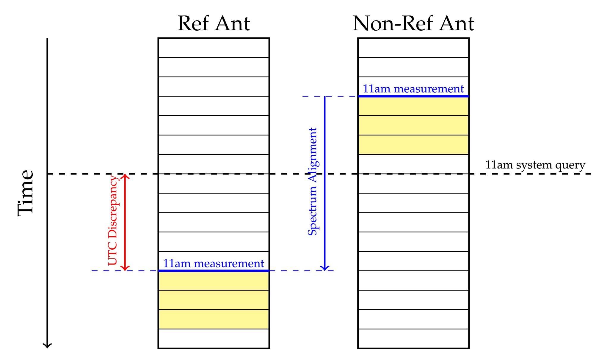

The aim of this section is to provide a clear, step by step explanation of each component of the pipeline.

Our antenna Analogue to Digigal Converter (ADC) samples the antenna voltage at 250 MSPS.  Each antenna channelizes (using a PFB) the incoming timestream into 2048 channels (4096-point FT step). Thus our baseband data has spectra of channel width ~61 kHz and period ~16 microsecs. All data is saved to disk, so to save space, our data is also 1-bit quantized. 

The timestamping of our data suffers errors on the order of 1 second. Therefore, whenever data is accessed, there is a high level of uncertainty as to what actual recording time it corresponds to. Baseband spectra (each time sample of our channelizer) therefore serves as a natural time proxy for our data, as it is far more consistent than our timestamping.

We suffer two types of clock uncertainty. First, there is the relative alignment of our antenna. For interferometry to be accurate, we need to know these delays to nanosecond level precision. Second, there is the absolute UTC timing, i.e. the actual time at which data was recorded. This UTC discrepancy is important as an intermittent data analysis step, and is valuable for source phasing. The two sources of delay are visualized below.

