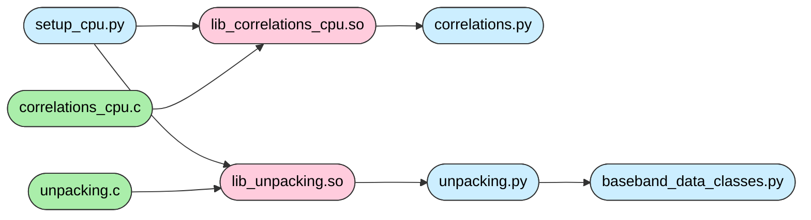

### Dependency tree

```mermaid
graph LR
    so_corr([lib_correlations_cpu.so])
    --> py_corr([correlations.py])

    py_setup([setup_cpu.py])
    --> so_unpk
    py_setup([setup_cpu.py])
    --> so_corr

    c_unpack([unpacking.c])
    --> so_unpk

    c_corr([correlations_cpu.c])
    --> so_corr

    so_unpk([lib_unpacking.so])
    --> py_unpk([unpacking.py])
    --> py_base([baseband_data_classes.py])

    style py_corr fill:#cef,stroke:#333,color:#000;
    style py_setup fill:#cef,stroke:#333,color:#000;
    style py_base fill:#cef,stroke:#333,color:#000;
    style py_unpk fill:#cef,stroke:#333,color:#000;
    style c_unpack fill:#aea,stroke:#333,color:#000;
    style c_corr fill:#aea,stroke:#333,color:#000;
    style so_corr fill:#fcd,stroke:#333,color:#000;
    style so_unpk fill:#fcd,stroke:#333,color:#000;
```

